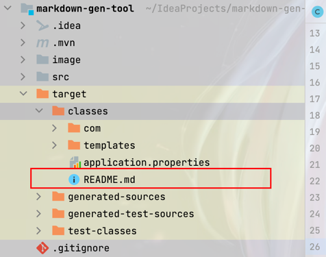
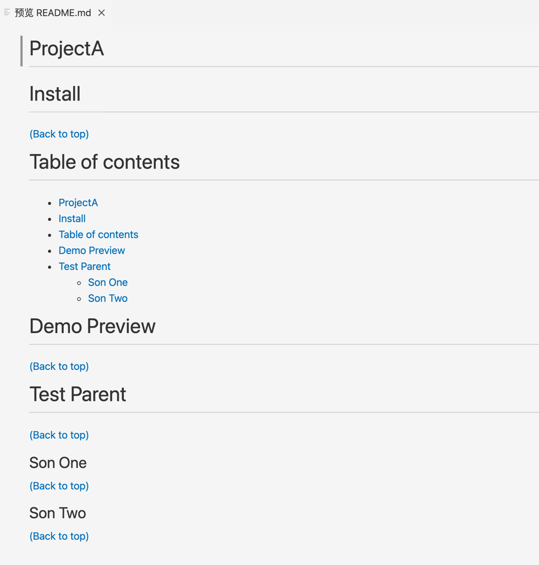

# Markdown Gen Tool

自用的快速生成项目README文档工具。

# Table of contents

- [Markdown Gen Tool](#markdown-gen-tool)
- [Table of contents](#table-of-contents)
- [Demo Preview](#demo-preview)

# Demo Preview

执行以下请求或者执行单元测试：

```http request
POST http://localhost:8081/gen/ProjectA
Content-Type: application/json

[
  {"code":"01", "name":"Install"},
  {"code":"02", "name":"Table of contents"},
  {"code":"03", "name":"Demo Preview"},
  {"code":"04", "name":"Test Parent"},
  {"code":"041", "name":"Son One"},
  {"code":"042", "name":"Son Two"}
]
```

执行生成的文档会在资源目录中：




